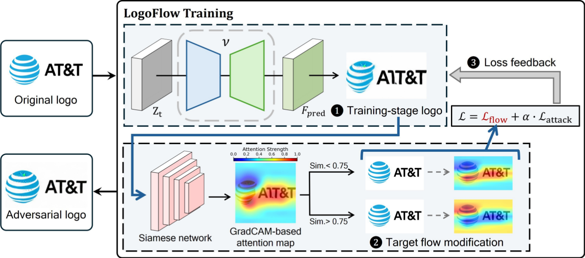
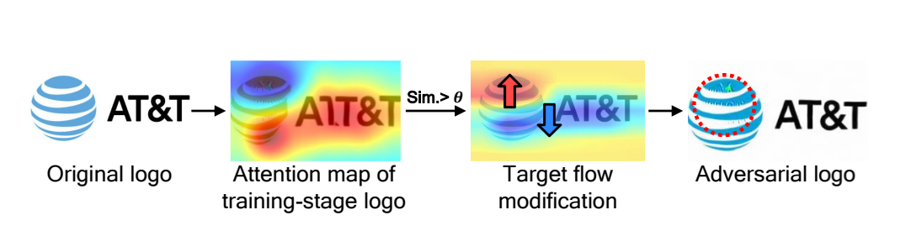

## LogoFlow: Attention-Guided Adversarial Logo Generation against Siamese Phishing Detectors

LogoFlow is a framework designed to generate adversarial logo samples capable of evading state-of-the-art visual phishing detectors, such as **PhishIntention**.  
This repository includes the full training pipeline, sampling script, and all necessary components to reproduce the adversarial logo generation process.

By leveraging attention-guided perturbations and rectified flow–based generative modeling, LogoFlow enables controlled manipulation of logo appearance while preserving human-recognizable semantics.





---

## Environment

Set up the LogoFlow environment using **Python 3.8**:

```bash
conda create -n LogoFlow python=3.8
conda activate LogoFlow
```

Install required dependencies:

```bash
pip install -r requirements.txt
```


## Training

Train the adversarial logo generator using:

```python
python train_logo.py
```

## Sampling

To generate adversarial logo samples from a trained model:

```python
python sampling.py
```


## Citations
